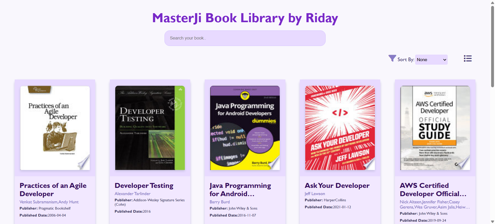

# MasterJi Book Library by Riday

MasterJi Book Library by Riday is a lightweight and responsive web application that allows users to search, sort, and browse a collection of books. This project leverages modern JavaScript modules, Axios for API requests, and Font Awesome for icons to deliver an engaging user experience.

---

## Table of Contents

- [Features](#features)
- [Screenshots](#screenshots)
- [Live Demo](#live-demo)
- [Tech Stack](#tech-stack)
- [Installation](#installation)
- [Usage](#usage)
- [Contributing](#contributing)
- [License](#license)
- [Contact](#contact)

---

## Features

- **Search Functionality:** Quickly search for your favorite books using the search bar.
- **Sorting Options:** Sort books by title (A-Z, Z-A) or by date (oldest/newest).
- **Responsive Design:** Fully optimized layout for both desktop and mobile devices.
- **Grid & List View:** Toggle between grid and list views to display book details.
- **Pagination:** Seamless navigation through multiple pages of book results.
- **Modern JavaScript:** Utilizes ES6 modules and Axios for handling API calls.
- **Stylish UI:** Clean design enhanced by Font Awesome icons.

---

## Screenshots

<table>
  <tr>
    <td></td>
    <td></td>
  </tr>
  <tr>
    <td align="center"><b>Desktop View</b></td>
    <td align="center"><b>Mobile View</b></td>
  </tr>
</table>

---

## Live Demo

Check out the live version of the app here:  
[MasterJi Book Library Live Demo](https://masterji-book-library.netlify.app/)

---

## Tech Stack

- **HTML5 & CSS3:** For structuring and styling the web pages.
- **JavaScript (ES6 Modules):** Dynamic functionality and modern syntax.
- **Axios:** For handling API requests.
- **Font Awesome:** For incorporating stylish icons.
- **Optional:** You can integrate any backend API for fetching book data if needed.

---

## Installation

Follow these steps to run the project locally:

1. **Clone the repository:**
   ```bash
   git clone https://github.com/rdmondal100/03-masterji-book-library-app.git
   cd 03-masterji-book-library-app

2. **Run the application:** Open index.html directly in your browser or run a local development server:
    ```bash
     npx serve .
    ```
